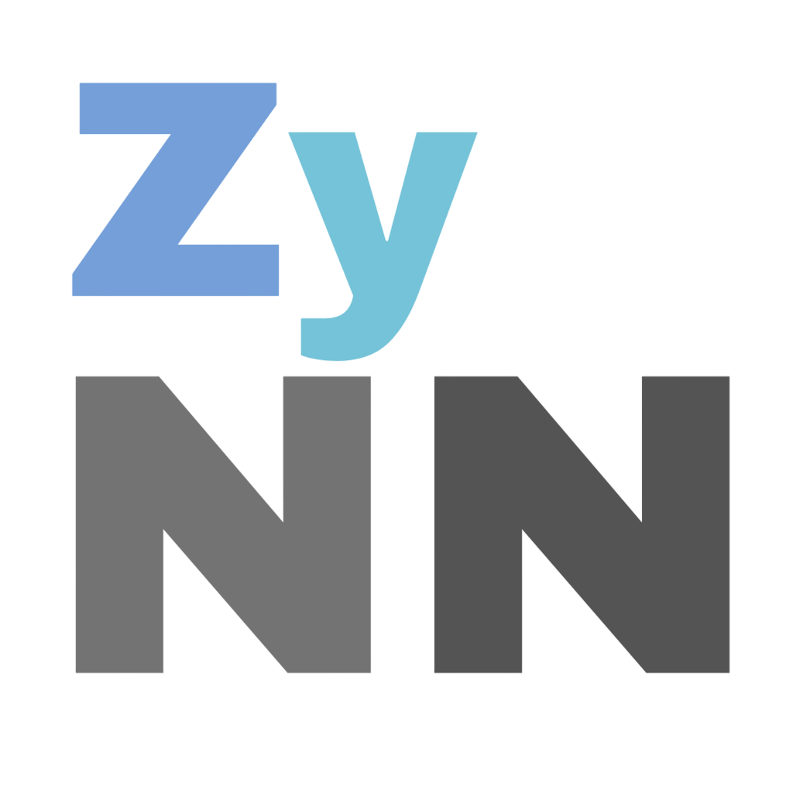

     
    <strong>A lightweight framework for neural networks.</strong>  
    
    
    

## 1. 📖 About

ZyNN aims to be a lightweight framework for neural network training and inference.
The motivation for this project is to optimize the build process to get fast inference. 

<strong>"Long optimizing, fast execution."</strong>

## 2. 🔧 Features (planned)
- 💾 Custom file format
- ⚡ Speed and performance for execution
- ✨General device support with OpenCL (CPU & GPU)

## 3. ⛏️ Milestones
- [ ] MNIST dataset training
- [ ] Convolution networks
- [ ] Transformer made with ZyNN
- [ ] Pytorch wrapper